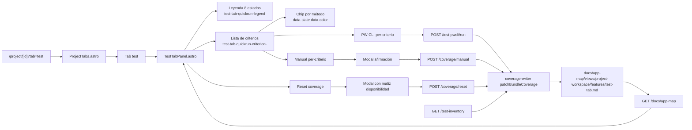

# Tab Test — Sistema de testing funcional del proyecto colpruebas

## 1. URL

`/project/511a017a-01d4-4553-a063-ba01438b15cd?tab=test`

## 2. Tab

`test` — tab nueva del workspace de proyecto junto a las tabs estándar del layout Astro.

Tres sub-secciones:

- **5.1 Dashboard de configuración** — formulario persistido por proyecto (placeholder mínimo).
- **5.2 Sistema de testeo rápido** — tabla de criterios del bundle `test-tab.md` con chips por método, botones per-criterio y reset.
- **5.3 Tareas programadas de test** — placeholder (sin scheduler real en este managed project).

## 3. Norma visual de estado (PWT-03 / PWT-08)

| Estado derivado | Disponibilidad | Resultado | Color | Texto |
| --- | --- | --- | --- | --- |
| `no-test` | `no-test` | — | gris muted | `Sin test` / `Sin PW-AUTO` |
| `not-applicable` | `not-applicable` | `not-applicable` | gris muted | `No aplica` |
| `not-run` | `exists` | sin corrida post-reset | rojo | `Pendiente` |
| `failed` | `exists` | última corrida falló | rojo | `Falló` |
| `passed` | `exists` | última corrida pasó | verde | `Cubierto` |
| `partial` | `exists` | corrida parcial | ámbar | `Parcial` |
| `manual-evidence` | con cobertura | `covered` (Manual OK) | verde/azul | `Evidencia` |
| `manual-missing` | sin cobertura | — | gris (ámbar si obligatorio) | `Sin evidencia` |

## 4. Endpoints backend (PWT-04..PWT-07)

| Método | URL | Body | Response |
| --- | --- | --- | --- |
| GET | `/api/projects/[id]/docs/app-map` | — | `{ criteria, navigation }` |
| GET | `/api/projects/[id]/test-inventory` | query `?bundle=<rel>` | `{ criteria: { [id]: { hasUnitTest, hasPwautoSpec } } }` |
| POST | `/api/projects/[id]/docs/app-map/coverage/manual` | `{ criterionId, bundlePath }` | `{ ok, criterionId, sha256 }` |
| POST | `/api/projects/[id]/docs/app-map/coverage/reset` | `{ bundlePath }` | `{ ok, bundlesTouched, criteriaReset, failed }` |
| POST | `/api/projects/[id]/test-pwcli/run` | `{ criterionId, bundlePath }` | `{ ok, criterionId, verdict, agent: 'mock-pwcli' }` |

Writer atómico: `gray-matter` parse → SHA-256 pre → patch `criteria[].coverage.<method>` → stringify body verbatim → tmp → `fs.renameSync` → SHA-256 post.

## 5. Diagrama

