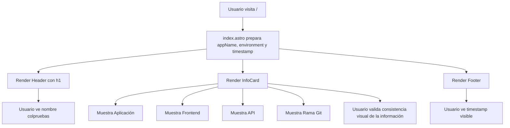

# Home View - Diagrama de Flujo

Este diagrama documenta la vista pública `/` de `colpruebas` según la implementación actual en Astro.

```mermaid
flowchart TD
    A[Usuario visita /] --> B[index.astro prepara appName, environment y timestamp]
    B --> C[Render Header con h1]
    B --> D[Render InfoCard]
    B --> E[Render Footer]

    D --> F[Muestra Aplicación]
    D --> G[Muestra Frontend]
    D --> H[Muestra API]
    D --> I[Muestra Rama Git]

    C --> J[Usuario ve nombre colpruebas]
    E --> K[Usuario ve timestamp visible]
    D --> L[Usuario valida consistencia visual de la información]
```
